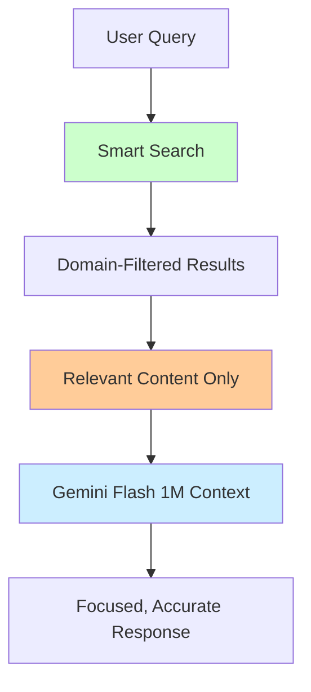
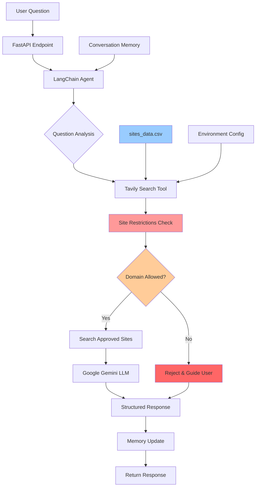

# Domain-Specific Q&A Agent

**A simpler, more practical alternative to traditional RAG systems** - demonstrating how modern LLMs with large context windows can eliminate the complexity of Retrieval-Augmented Generation for many documentation Q&A use cases.

As we enter 2025, there's growing debate in the AI community about whether RAG is becoming obsolete. With models like Gemini Flash offering 1M+ token context windows and Meta's Llama 4 Scout supporting 10M tokens, many developers are questioning: **"Why build complex RAG pipelines when you can just search and load everything into context?"**

This project explores that exact question - showcasing a **search-first approach** that leverages modern LLM capabilities while maintaining organizational safety through domain restrictions and guardrails.

Perfect for organizations wanting to create internal knowledge assistants that stay within approved documentation boundaries without the overhead of traditional RAG infrastructure.

## Features

- 🏢 **Organizational Knowledge Assistant** - Safely search only approved company documentation
- 🛡️ **Built-in Guardrails** - Tavily site restrictions prevent searching unauthorized domains
- 🎯 **Domain Enforcement** - Agent refuses to answer questions outside configured knowledge base
- 🤖 **Structured Chat Agent** - LangChain agent with Google Gemini 2.0 Flash for reliable responses
- 🔍 **Controlled Search Scope** - Tavily API with explicit site allowlisting via `include_domains`
- 🚀 **Production-Ready API** - FastAPI with automatic documentation and health checks
- 💬 **Conversation Memory** - Maintains context across user interactions
- 🐳 **Enterprise Deployment** - Docker support with security best practices
- 📊 **Usage Monitoring** - Built-in health checks and error handling
- 📚 **Educational & Practical** - Clear code structure for learning and adaptation

## Is RAG Dead? The 2025 Context Window Revolution

As we enter 2025, the AI community is engaged in a heated debate: **"Is RAG dead?"** The emergence of models with massive context windows has sparked discussions about whether we still need complex retrieval systems.

### The Debate Context

Recent discussions across AI communities suggest that **many believe RAG will be obsolete by 2025**. Here's why this debate matters:

**The "RAG is Dead" Argument:**
- **10M+ token context windows** (Meta Llama 4 Scout, Google Gemini 2.5 Pro) can fit entire knowledge bases
- No more chunking complexity or embedding maintenance
- Simplified architecture: just load everything into context
- No semantic loss from document segmentation

**The "RAG Still Lives" Counter-argument:**
- **Cost efficiency**: Processing 10M tokens costs significantly more than targeted retrieval
- **Latency issues**: Large context windows increase response times substantially  
- **"Lost in the middle" problem**: Models struggle with information buried in massive contexts
- **Signal vs noise**: Targeted retrieval provides cleaner, more relevant context

### Latest Model Context Windows (2025)

| Model | Context Window | Reality Check |
|-------|----------------|---------------|
| Meta Llama 4 Scout | 10M tokens | $50+ per query vs $0.025 with RAG |
| Google Gemini 2.5 Pro | 5M tokens | 30s+ response time vs 2-5s with RAG |
| Anthropic Claude 4 | 1M tokens | Attention degradation at extremes |
| OpenAI GPT-o4 | 1M tokens | Cost scales linearly with context |

### **Cost Reality Check**

```python
# The brutal math of large context
large_context_cost = 10_000_000 * $0.005/1000  # $50 per query
rag_cost = 5_000 * $0.005/1000                 # $0.025 per query

# 2000x cost difference! 💸
```

### **Performance Reality**

Recent studies ([The New Stack, 2025](https://thenewstack.io/do-enormous-llm-context-windows-spell-the-end-of-rag/)) show:

- **Accuracy degrades** as context length increases beyond 100K tokens
- **Latency increases exponentially** with context size
- **"Lost in the middle"** phenomenon where models miss information buried in long contexts
- **Attention diffusion** makes models less focused on relevant details

### **Why This Project Chooses Search-First Over Pure RAG**

This project demonstrates a **third way** - neither traditional RAG nor massive context loading, but **intelligent search with targeted context**:



### **The Hybrid Future (2025 Approach)**

Smart systems are emerging that combine the best of both worlds:

**For Documentation Q&A:**
- ✅ **Search-first** for public, well-structured docs (this project)
- ✅ **Smart context loading** - only relevant pages, not entire knowledge bases
- ✅ **Cost optimization** - 5K targeted tokens vs 10M everything tokens
- ✅ **Always fresh** - search results reflect latest documentation

**When Traditional RAG Still Wins:**
- 🏢 **Private enterprise data** with strict access controls
- ⚡ **Ultra-low latency** requirements (<100ms)
- 💾 **Offline scenarios** where search APIs aren't available
- 🔐 **Fine-grained permissions** on document chunks

### **Industry Reality (2025)**

Leading companies are **not** abandoning RAG:
- **OpenAI** uses RAG for ChatGPT's real-time information
- **Google** combines search with Bard/Gemini for current data
- **Anthropic** emphasizes RAG for enterprise Claude deployments
- **Microsoft** powers Copilot with hybrid RAG+search architectures

### **Decision Framework for 2025**

```python
def choose_approach(use_case):
    if use_case.data_type == "public_docs" and use_case.budget == "moderate":
        return "search_first"  # This project's approach
    elif use_case.latency_requirement < 100 and use_case.scale == "massive":
        return "traditional_rag"
    elif use_case.context_size < 50000 and use_case.cost_sensitivity == "low":
        return "large_context"
    else:
        return "hybrid_approach"
```

### **The Verdict**

**RAG isn't dead - it's evolving.** The future belongs to **intelligent hybrid systems** that:

1. **Use search** for fresh, public information (like this project)
2. **Apply RAG** for private, enterprise data
3. **Leverage large context** for deep document analysis
4. **Optimize costs** by choosing the right tool for each query

This project represents the **2025 pragmatic approach** - acknowledging that while 10M token context windows are impressive, **smart search with targeted context** often delivers better results at a fraction of the cost.

**For documentation Q&A in 2025: Search-first beats both traditional RAG and massive context windows.** 🚀

## How Guardrails Work

This project demonstrates **organizational AI safety** through multiple layers:

### 1. **Tavily Site Restrictions**
```python
# Only search these approved domains
include_domains = ["docs.langchain.com", "fastapi.tiangolo.com"]
```

### 2. **Agent Prompt Guardrails** 
- Agent is instructed to ONLY use the search tool
- Questions outside available domains are explicitly rejected
- Users are guided to available knowledge areas

### 3. **Configuration Control**
- `sites_data.csv` defines the complete knowledge boundary
- No hallucination - agent cannot answer without searching
- Clear messaging when information is unavailable

## Architecture



## Quick Start

### Option 1: Using Make (Recommended)

```bash
# Clone the repository
git clone https://github.com/javiramos1/qagent.git
cd qagent

# Setup environment and install dependencies
make install

# Copy and configure environment variables
cp .env.example .env
# Edit .env with your API keys

# Run the application
make run
```

### Option 2: Using Docker

```bash
# Clone the repository
git clone https://github.com/javiramos1/qagent.git
cd qagent

# Copy and configure environment variables
cp .env.example .env
# Edit .env with your API keys

# Run with Docker Compose
make docker-run
```

## API Documentation

Once running, visit:
- **Interactive API Docs**: http://localhost:8000/docs
- **Alternative Docs**: http://localhost:8000/redoc
- **Health Check**: http://localhost:8000/health

## API Endpoints

### GET `/domains`
Get list of available domains the agent can search.

### POST `/chat`
Send a question to the agent.
```json
{
  "message": "How do I create a FastAPI application?",
  "reset_memory": false
}
```

### POST `/reset`
Reset the conversation memory.

### GET `/health`
Detailed health check with system status.

## Configuration

### Required Environment Variables

```bash
GOOGLE_API_KEY=your_google_api_key_here    # Get from Google Cloud Console
TAVILY_API_KEY=your_tavily_api_key_here    # Get from Tavily.com
```

### Optional Environment Variables

```bash
# Search Configuration
MAX_RESULTS=5                    # Maximum search results per query
SEARCH_DEPTH=basic              # Search depth: basic or advanced
MAX_CONTENT_SIZE=10000          # Maximum content size per result

# LLM Configuration
LLM_TEMPERATURE=0.1             # Response creativity (0.0-1.0)
LLM_MAX_TOKENS=3000            # Maximum response length

# Timeout Configuration
REQUEST_TIMEOUT=30              # Request timeout in seconds
LLM_TIMEOUT=60                 # LLM response timeout in seconds
```

## Domain Configuration

Edit `sites_data.csv` to configure which domains the agent can search:

```csv
domain,site,description
LangChain,docs.langchain.com,Official LangChain documentation
FastAPI,fastapi.tiangolo.com,FastAPI framework documentation
```

**This is your organization's knowledge boundary** - the agent will only search these approved sites and reject questions about anything else.

## Organizational Use Cases

### Internal Documentation Assistant
- Employee onboarding guides
- HR policy documentation  
- Technical documentation
- Process and procedure manuals

### Customer Support Knowledge Base
- Product documentation
- FAQ resources
- Troubleshooting guides
- API documentation

### Compliance and Safety
- Regulatory documentation
- Safety procedures
- Compliance guidelines
- Audit requirements

## How Site Restrictions Work

### Tavily Integration
```python
# In custom_search_tool.py
search_params = {
    "query": query,
    "include_domains": [site_info["site"] for site_info in sites_info],
    "max_results": max_results,
    "search_depth": search_depth
}
```

### Agent Enforcement
- Agent **must** use search tool for every question
- Questions outside configured domains trigger rejection responses
- Clear user guidance about available knowledge areas

### Benefits for Organizations
- ✅ **No data leakage** - searches only approved sources
- ✅ **No hallucination** - responses based only on real documentation  
- ✅ **Audit trail** - all searches are logged and traceable
- ✅ **Easy updates** - modify `sites_data.csv` to change knowledge scope
- ✅ **Cost control** - limited search scope reduces API usage

## Educational Goals

This project demonstrates how organizations can:

- ✅ **Implement AI Guardrails** - Prevent unauthorized knowledge access
- ✅ **Create Safe AI Assistants** - Domain-restricted organizational tools
- ✅ **Use Tavily Site Restrictions** - Technical implementation of search boundaries
- ✅ **Build LangChain Agents** - Structured chat agents with tools and constraints
- ✅ **Deploy Production AI** - FastAPI, Docker, and monitoring
- ✅ **Manage AI Knowledge Scope** - Configuration-driven domain control
- ✅ **Ensure Response Reliability** - Force tool usage to prevent hallucination

## Development

### Available Make Commands

```bash
make help          # Show all available commands
make install       # Setup virtual environment and dependencies
make run           # Run the application locally
make test          # Run tests
make clean         # Clean up temporary files
make docker-build  # Build Docker image
make docker-run    # Run with docker-compose
make docker-stop   # Stop docker-compose services
make format        # Format code with black
make lint          # Run linting checks
```

### Development Workflow

1. **Setup Development Environment**
   ```bash
   make install
   make dev-install  # Install development dependencies
   ```

2. **Make Changes**
   ```bash
   # Edit code
   make format      # Format code
   make lint        # Check code quality
   ```

3. **Test Changes**
   ```bash
   make test        # Run tests
   make run         # Test locally
   ```

4. **Docker Testing**
   ```bash
   make docker-build
   make docker-run
   make docker-logs   # View logs
   ```

## Project Structure

```
qagent/
├── main.py                 # FastAPI application entry point
├── qa_agent.py            # Core Q&A agent implementation
├── custom_search_tool.py  # Tavily search tool wrapper
├── sites_data.csv         # Domain configuration
├── requirements.txt       # Python dependencies
├── Dockerfile            # Docker configuration
├── docker-compose.yml    # Docker Compose setup
├── Makefile             # Development commands
├── .env.example         # Environment variables template
├── .gitignore          # Git ignore rules
└── README.md           # This file
```

## How It Works

### 1. Agent Architecture
- **LangChain Structured Chat Agent** coordinates the workflow
- **Google Gemini 2.0 Flash** provides the language model capabilities
- **Tavily Search Tool** performs domain-restricted web searches
- **Conversation Memory** maintains context across interactions

### 2. Domain Restriction
- Agent ONLY searches configured domains in `sites_data.csv`
- Questions outside available domains are rejected with helpful guidance
- Search results are filtered to specified sites

### 3. Structured Chat Format
- Uses LangChain's structured chat format with JSON actions
- Follows ReACT pattern: Reason → Act → Observe → Respond
- Enforces tool usage for all questions

## Troubleshooting

### Common Issues

1. **API Key Errors**
   - Ensure `.env` file exists with valid API keys
   - Check API key permissions and quotas

2. **Import Errors**
   - Activate virtual environment: `source qagent_venv/bin/activate`
   - Install dependencies: `make install`

3. **Docker Issues**
   - Ensure Docker is running
   - Check port 8000 is available
   - View logs: `make docker-logs`

4. **Search Not Working**
   - Verify domain configuration in `sites_data.csv`
   - Check Tavily API key and quota

### Getting Help

- Check the [FastAPI documentation](https://fastapi.tiangolo.com/)
- Review [LangChain documentation](https://docs.langchain.com/)
- Examine the logs for error details

## License

This project is licensed under the Apache License 2.0 - see the [LICENSE](LICENSE) file for details.

### Copyright Notice

```
Copyright 2024 Javi Ramos

Licensed under the Apache License, Version 2.0 (the "License");
you may not use this file except in compliance with the License.
You may obtain a copy of the License at

    http://www.apache.org/licenses/LICENSE-2.0

Unless required by applicable law or agreed to in writing, software
distributed under the License is distributed on an "AS IS" BASIS,
WITHOUT WARRANTIES OR CONDITIONS OF ANY KIND, either express or implied.
See the License for the specific language governing permissions and
limitations under the License.
```

## Contributing

Contributions are welcome! This project follows the Apache 2.0 license terms:

- ✅ **Fork and experiment** with the codebase
- ✅ **Submit pull requests** for improvements
- ✅ **Use in commercial projects** (with proper attribution)
- ✅ **Create derivative works** while maintaining license compliance
- ✅ **Educational use** encouraged for learning AI agent development

Please ensure any contributions maintain the educational focus and include proper documentation.

## Acknowledgments

- **LangChain** - Framework for building applications with large language models
- **Google Gemini** - Advanced language model capabilities
- **Tavily** - Web search API with domain restriction capabilities
- **FastAPI** - Modern, fast web framework for building APIs

---

**Note**: This is an educational project demonstrating enterprise AI assistant development with proper guardrails and security measures. Feel free to adapt and extend for your organizational needs while respecting the Apache 2.0 license terms. 