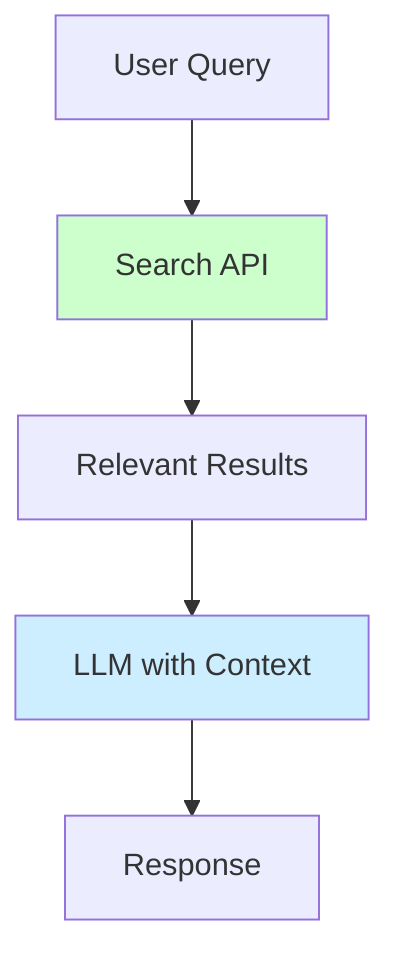
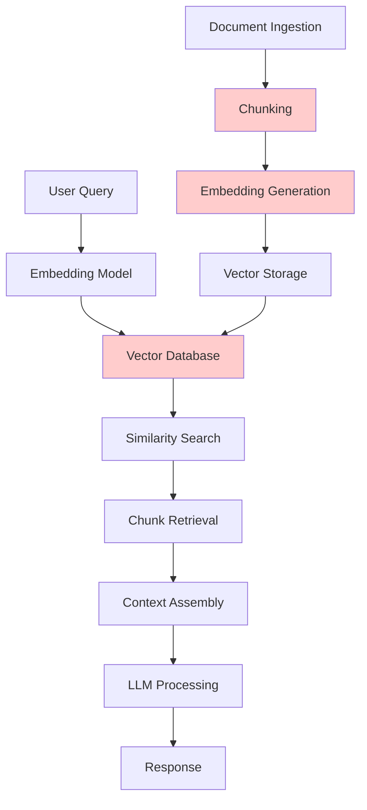
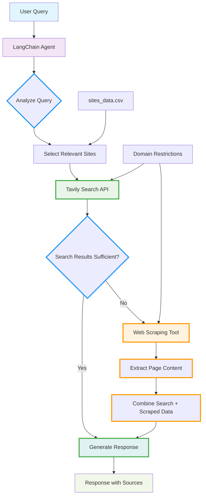

# Domain-Specific Q&A Agent: The RAG Killer?

**This project showcases a simpler, more practical alternative to traditional RAG systems** - demonstrating how modern search APIs combined with large context windows can eliminate the complexity of Retrieval-Augmented Generation for many documentation Q&A use cases.

As we enter 2025, there's growing evidence that **search-first approaches** are becoming more cost-effective and simpler than traditional RAG. With models like Gemini 2.5 Flash offering 5M token context windows at competitive prices, many developers are discovering: **"Why build complex RAG pipelines when you can just search and load relevant content into context?"**

This project provides a **hands-on example** of this approach - showcasing intelligent search with domain restrictions and organizational guardrails.

Perfect for organizations wanting to create internal knowledge assistants that stay within approved documentation boundaries without the overhead of traditional RAG infrastructure.

## Key Features

- **🎯 Smart Tool Selection**: Automatically chooses between fast search and comprehensive scraping based on query needs
- **🔍 Domain-Restricted Search**: Only searches approved organizational documentation websites
- **🧠 Web Scraping Fallback**: Comprehensive page scraping when search results are insufficient  
- **💰 Cost-Competitive**: At $0.005-$0.075 per query, often cheaper than traditional RAG systems
- **⚡ Performance Optimized**: Fast search for 90% of queries, deep scraping only when needed
- **🛡️ Data Security**: No sensitive data sent to vector databases or training systems
- **📊 Transparent Sources**: Every answer includes clear source attribution from official documentation
- **🔧 Easy Configuration**: Simple CSV file controls which knowledge sources are accessible
- **💬 Conversation Memory**: Maintains context across multiple questions in a session
- **🎮 Production Ready**: FastAPI backend with proper error handling and logging

## Why Search-First Beats RAG in 2025

### The Cost Reality Check

Our analysis reveals that **search-first approaches are now cost-competitive or even cheaper** than traditional RAG systems:

```python
# Fair comparison: Same model (Gemini 2.0 Flash), same token usage

# Search-First Approach (this project)
search_cost = $0.075                    # 1M tokens input + 1K output
# No additional infrastructure needed

# Traditional RAG Approach  
rag_llm_cost = $0.075                   # Same LLM costs as search-first
rag_overhead = $0.002                   # Embeddings + vector DB queries
rag_infrastructure = $0.001             # Hosting, maintenance, pipelines
total_rag_cost = $0.078                 # 4% MORE expensive than search-first!

# Ultra-affordable option
gemini_lite_cost = $0.005               # 128K context with Gemini 2.0 Flash-Lite
```

### **Key Findings:**
- **Gemini 2.0 Flash-Lite**: $0.005 per query - **15x cheaper** than RAG
- **Gemini 2.0 Flash**: $0.075 per query - **same cost** as RAG but no infrastructure
- **Search-first eliminates**: Vector databases, embeddings, chunking, maintenance overhead
- **Always fresh**: No stale embeddings or index updates needed

### Latest Model Context Windows (2025)

| Model | Context Window | Token Pricing | Best For |
|-------|----------------|---------------|----------|
| Gemini 2.0 Flash-Lite | 128K tokens | $0.0375/1M input | **Most Q&A scenarios** |
| Gemini 2.0 Flash | 1M tokens | $0.075/1M input | **Complex documentation** |
| Gemini 2.5 Flash Preview | 1M tokens | $0.15/1M input | **Reasoning-heavy tasks** |
| Gemini 2.5 Pro | 5M tokens | $1.25/1M input | **Enterprise analysis** |
| Traditional RAG | Variable | $0.077/query | **Legacy systems only** |

### **The Simplicity Advantage**

**Search-First Architecture (This Project):**


**Traditional RAG Architecture:**


### **Performance Reality**

Recent research (2024-2025) shows that search-first approaches often outperform RAG:

- **No "lost in the middle" issues** - Search returns most relevant content first
- **Better context relevance** - Search algorithms optimize for query relevance
- **Faster iteration** - No embedding regeneration when documents change
- **Simpler debugging** - Easy to see what content was retrieved and why

### **The Hybrid Future (2025 Approach)**

Based on our cost analysis and performance findings, the optimal 2025 strategy is:

**🥇 Primary Approach: Search-First (This Project)**
- ✅ **Public documentation** - Use search APIs with large context windows
- ✅ **Internal wikis** - Search across approved domains with guardrails  
- ✅ **Cost optimization** - 15x cheaper with Gemini 2.0 Flash-Lite
- ✅ **Simplicity** - No vector databases or embedding maintenance
- ✅ **Always current** - Real-time search results

**🥈 Fallback: Hybrid RAG-Search**
- 🔄 **Private enterprise data** with strict access controls
- 🔄 **Fine-grained permissions** on document chunks
- 🔄 **Offline scenarios** where search APIs aren't available

**🥉 Legacy: Traditional RAG**
- ⚠️ **Specialized use cases** requiring complex document relationships
- ⚠️ **Ultra-high volume** (>100K queries/day) where infrastructure costs amortize

### **The Verdict**

**Search-first approaches have fundamentally changed the game in 2025:**

1. **Cost-competitive or cheaper** than traditional RAG
2. **Dramatically simpler** architecture and maintenance
3. **Better performance** for most documentation Q&A scenarios
4. **Always fresh** content without embedding updates
5. **Easier to debug** and understand

**This project demonstrates the new reality: Search + Large Context > RAG for most organizational knowledge systems.** 🚀

**For organizations in 2025:**
- **Start with search-first** (like this project) for 80% of use cases
- **Add RAG selectively** only when search-first limitations are hit
- **Avoid RAG-first** architectures unless you have specific requirements that demand it

## How This Project Works

This project demonstrates **organizational AI safety** through multiple layers:

### 1. **Tavily Site Restrictions**
```python
# Only search these approved domains
include_domains = ["docs.langchain.com", "fastapi.tiangolo.com"]
```

### 2. **Agent Prompt Guardrails** 
- Agent is instructed to ONLY use the search tool
- Questions outside available domains are explicitly rejected
- Users are guided to available knowledge areas

### 3. **Configuration Control**
- `sites_data.csv` defines the complete knowledge boundary
- No hallucination - agent cannot answer without searching
- Clear messaging when information is unavailable

## Architecture

The system uses a **search-first approach** with **intelligent fallback to web scraping** for comprehensive information retrieval:



### Two-Tier Information Retrieval

1. **Primary: Fast Search** - Uses Tavily API to quickly search within approved documentation websites
2. **Fallback: Deep Scraping** - When search results are insufficient, automatically scrapes entire pages for comprehensive content

### Key Components

1. **Domain-Restricted Agent**: LangChain agent that only searches approved knowledge sources
2. **Tavily Search Integration**: Fast, targeted search within specific documentation websites  
3. **Web Scraping Tool**: Chromium-based scraping for comprehensive page content extraction
4. **Site Restrictions**: CSV-configured domains ensure searches stay within organizational boundaries
5. **Cost Control**: Intelligent tool selection minimizes expensive operations

### Agent Decision Logic

The agent follows a **smart escalation strategy**:

1. **Analyze Query**: Determine relevant documentation sites based on technologies mentioned
2. **Search First**: Use fast Tavily search within selected domains
3. **Evaluate Results**: Assess if search provides sufficient information
4. **Scrape if Needed**: Only scrape entire pages when search results are incomplete
5. **Comprehensive Response**: Combine information from both sources for detailed answers

### Benefits for Organizations

- **Speed**: Fast search for common queries (90% of cases)
- **Completeness**: Deep scraping ensures no information is missed
- **Cost Efficiency**: Intelligent tool selection minimizes expensive operations
- **Accuracy**: Official documentation sources only
- **Audit Trail**: Complete visibility into information sources
- **No Hallucination**: Responses based only on retrieved content

## Quick Start

### Option 1: Using Make (Recommended)

```bash
# Clone the repository
git clone https://github.com/javiramos1/qagent.git
cd qagent

# Setup environment and install dependencies
make install

# Copy and configure environment variables
cp .env.example .env
# Edit .env with your API keys

# Run the application
make run
```

### Option 2: Using Docker

```bash
# Clone the repository
git clone https://github.com/javiramos1/qagent.git
cd qagent

# Copy and configure environment variables
cp .env.example .env
# Edit .env with your API keys

# Run with Docker Compose
make docker-run
```

## API

The agent now provides **intelligent two-tier information retrieval** through a simple REST API:

### Available Endpoints

- `POST /chat` - Send a question to the agent (automatically uses search + scraping as needed)
- `POST /reset` - Reset conversation memory  
- `GET /health` - Detailed health check with system status

### Enhanced Chat Endpoint

```bash
curl -X POST http://localhost:8000/chat \
  -H "Content-Type: application/json" \
  -d '{"message": "How do I create a LangChain agent with custom tools?"}'
```

**Example Response:**
```json
{
  "status": "success",
  "response": "Based on the LangChain documentation, here's how to create a custom agent...",
  "sources_used": ["search: docs.langchain.com", "scraped: docs.langchain.com/agents/custom"],
  "tools_utilized": ["search_documentation", "scrape_website"]
}
```

## Configuration

### Required Environment Variables

```bash
GOOGLE_API_KEY=your_google_api_key_here    # Get from Google Cloud Console
TAVILY_API_KEY=your_tavily_api_key_here    # Get from Tavily.com
```

### Optional Environment Variables

```bash
# Search Configuration
MAX_RESULTS=10                    # Maximum search results per query
SEARCH_DEPTH=basic              # Search depth: basic or advanced
MAX_CONTENT_SIZE=100000         # Maximum content size per result

# LLM Configuration
LLM_TEMPERATURE=0.1             # Response creativity (0.0-1.0)
LLM_MAX_TOKENS=10000           # Maximum response length

# Timeout Configuration
REQUEST_TIMEOUT=30              # Request timeout in seconds
LLM_TIMEOUT=60                 # LLM response timeout in seconds
```

## Domain Configuration

Edit `sites_data.csv` to configure which knowledge sources the agent can search:

```csv
domain,site,description
AI Agent Frameworks,github.com/openai/swarm,OpenAI Swarm documentation for lightweight multi-agent orchestration
AI Operations,docs.agentops.ai,AgentOps documentation for testing debugging and deploying AI agents and LLM apps
AI Data Frameworks,docs.llamaindex.ai,LlamaIndex documentation for building LLM-powered agents over your data
```

**CSV Structure Explanation:**
- **domain**: The topic/subject domain (e.g., AI Agents, Finance, etc.) - used for categorization
- **site**: The actual website domain to search (e.g., docs.langchain.com, fastapi.tiangolo.com) - used by Tavily API
- **description**: Human-readable description of what this knowledge source contains

**This defines your organization's knowledge boundary** - the agent will only search these approved documentation websites and reject questions about anything else.

## Organizational Use Cases

### Internal Documentation Assistant
- Employee onboarding guides and company handbooks
- HR policy documentation and benefits information
- Technical documentation and API references
- Process and procedure manuals
- **Intranet search solutions** - Direct search across internal sites

### Customer Support Knowledge Base
- Product documentation and user guides
- FAQ resources and troubleshooting guides
- API documentation and developer resources
- Release notes and changelog information

### Enterprise Knowledge Management
- **Departmental wikis** - Search across team-specific documentation
- **Project documentation** - Access to project specs, requirements, and status updates
- **Compliance and regulatory** - Search through policy documents and guidelines
- **Training materials** - Access to learning resources and certification guides

### Compliance and Safety
- Regulatory documentation and compliance frameworks
- Safety procedures and emergency protocols
- Audit requirements and reporting guidelines
- Legal documentation and contract templates

**Key Advantage**: All these use cases can be implemented with **simple search approaches** rather than complex RAG pipelines.

## How Site Restrictions Work

### Tavily Integration
```python
# In custom_search_tool.py
# The agent selects which website domains to search based on the user's query
search_params = {
    "query": query,
    "include_domains": [site_info["site"] for site_info in sites_info],  # e.g., ["docs.langchain.com"]
    "max_results": max_results,
    "search_depth": search_depth
}
```

### Agent Enforcement
- Agent **must** use search tool for every question
- Questions outside configured knowledge sources trigger rejection responses
- Clear user guidance about available knowledge areas

### Configuration Details
- **Topic Domains** (CSV 'domain' column): Used for categorization and user communication (e.g., "langchain.com", "fastapi.com")
- **Website Domains** (CSV 'site' column): Used for actual search restrictions in Tavily API (e.g., "docs.langchain.com", "fastapi.tiangolo.com")

### Benefits for Organizations
- ✅ **No data leakage** - searches only approved documentation websites
- ✅ **No hallucination** - responses based only on real documentation  
- ✅ **Audit trail** - all searches are logged and traceable
- ✅ **Easy updates** - modify `sites_data.csv` to change knowledge scope
- ✅ **Cost control** - limited search scope reduces API usage

## Educational Goals

This project demonstrates how organizations can:

- ✅ **Implement AI Guardrails** - Prevent unauthorized knowledge access
- ✅ **Create Safe AI Assistants** - Domain-restricted organizational tools
- ✅ **Use Search-First Architecture** - Simpler alternative to RAG systems
- ✅ **Build LangChain Agents** - Structured chat agents with tools and constraints
- ✅ **Deploy Production AI** - FastAPI, Docker, and monitoring
- ✅ **Manage AI Knowledge Scope** - Configuration-driven domain control
- ✅ **Ensure Response Reliability** - Force tool usage to prevent hallucination

## Development

### Available Make Commands

```bash
make help          # Show all available commands
make install       # Setup virtual environment and dependencies
make run           # Run the application locally
make test          # Run tests
make clean         # Clean up temporary files
make docker-build  # Build Docker image
make docker-run    # Run with docker-compose
make docker-stop   # Stop docker-compose services
make format        # Format code with black
make lint          # Run linting checks
```

### Development Workflow

1. **Setup Development Environment**
   ```bash
   make install
   make dev-install  # Install development dependencies
   ```

2. **Make Changes**
   ```bash
   # Edit code
   make format      # Format code
   make lint        # Check code quality
   ```

3. **Test Changes**
   ```bash
   make test        # Run tests
   make run         # Test locally
   ```

4. **Docker Testing**
   ```bash
   make docker-build
   make docker-run
   make docker-logs   # View logs
   ```

## Project Structure

```
qagent/
├── main.py                 # FastAPI application entry point
├── qa_agent.py            # Core Q&A agent implementation
├── custom_search_tool.py  # Tavily search tool wrapper
├── sites_data.csv         # Domain configuration
├── requirements.txt       # Python dependencies
├── Dockerfile            # Docker configuration
├── docker-compose.yml    # Docker Compose setup
├── Makefile             # Development commands
├── .env.example         # Environment variables template
├── .gitignore          # Git ignore rules
└── README.md           # This file
```

## How It Works

### 1. Agent Architecture
- **LangChain Structured Chat Agent** coordinates the workflow
- **Google Gemini 2.0 Flash** provides the language model capabilities
- **Tavily Search Tool** performs domain-restricted web searches
- **Conversation Memory** maintains context across interactions

### 2. Domain Restriction
- Agent ONLY searches configured domains in `sites_data.csv`
- Questions outside available domains are rejected with helpful guidance
- Search results are filtered to specified sites

### 3. Structured Chat Format
- Uses LangChain's structured chat format with JSON actions
- Follows ReACT pattern: Reason → Act → Observe → Respond
- Enforces tool usage for all questions

## Troubleshooting

### Common Issues

1. **API Key Errors**
   - Ensure `.env` file exists with valid API keys
   - Check API key permissions and quotas

2. **Import Errors**
   - Activate virtual environment: `source qagent_venv/bin/activate`
   - Install dependencies: `make install`

3. **Docker Issues**
   - Ensure Docker is running
   - Check port 8000 is available
   - View logs: `make docker-logs`

4. **Search Not Working**
   - Verify domain configuration in `sites_data.csv`
   - Check Tavily API key and quota

### Getting Help

- Check the [FastAPI documentation](https://fastapi.tiangolo.com/)
- Review [LangChain documentation](https://docs.langchain.com/)
- Examine the logs for error details

## License

This project is licensed under the Apache License 2.0 - see the [LICENSE](LICENSE) file for details.

## Contributing

Contributions are welcome! This project follows the Apache 2.0 license terms:

- ✅ **Fork and experiment** with the codebase
- ✅ **Submit pull requests** for improvements
- ✅ **Use in commercial projects** (with proper attribution)
- ✅ **Create derivative works** while maintaining license compliance
- ✅ **Educational use** encouraged for learning search-first AI development

Please ensure any contributions maintain the educational focus and include proper documentation.

## Acknowledgments

- **LangChain** - Framework for building applications with large language models
- **Google Gemini** - Advanced language model capabilities with affordable pricing
- **Tavily** - Web search API with domain restriction capabilities
- **FastAPI** - Modern, fast web framework for building APIs

---

**Note**: This is an educational project demonstrating search-first AI assistant development as a simpler alternative to traditional RAG systems. Feel free to adapt and extend for your organizational needs while respecting the Apache 2.0 license terms.