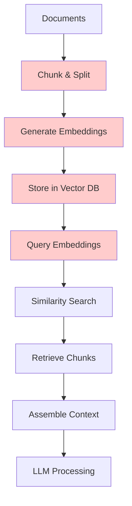

# Domain-Specific Q&A Agent

An educational example demonstrating how simple it is to create a **domain-restricted Q&A agent for organizations** to search their documentation safely. This project shows how to build guardrails using Tavily's site restrictions and LangChain's structured agents, ensuring the AI only answers questions about approved organizational resources.

Perfect for organizations wanting to create internal knowledge assistants that stay within approved documentation boundaries.

## Features

- 🏢 **Organizational Knowledge Assistant** - Safely search only approved company documentation
- 🛡️ **Built-in Guardrails** - Tavily site restrictions prevent searching unauthorized domains
- 🎯 **Domain Enforcement** - Agent refuses to answer questions outside configured knowledge base
- 🤖 **Structured Chat Agent** - LangChain agent with Google Gemini 2.0 Flash for reliable responses
- 🔍 **Controlled Search Scope** - Tavily API with explicit site allowlisting via `include_domains`
- 🚀 **Production-Ready API** - FastAPI with automatic documentation and health checks
- 💬 **Conversation Memory** - Maintains context across user interactions
- 🐳 **Enterprise Deployment** - Docker support with security best practices
- 📊 **Usage Monitoring** - Built-in health checks and error handling
- 📚 **Educational & Practical** - Clear code structure for learning and adaptation

## Why Search-First Beats RAG for Documentation Q&A

This project demonstrates a **paradigm shift** from traditional RAG (Retrieval-Augmented Generation) to a **Search-First approach** that leverages modern LLM capabilities like Gemini Flash's 1 million token context window.

### **Traditional RAG Approach**


### **Our Search-First Approach**
```mermaid
graph TD
    A[User Query] --> B[Tavily Search]
    B --> C[Live Web Results]
    C --> D[Filter by Domain]
    D --> E[Extract Relevant Content]
    E --> F[Gemini Flash (1M tokens)]
    
    style B fill:#ccffcc
    style C fill:#ccffcc
    style F fill:#ccffcc
```

### **Comparison Table**

| Aspect | Traditional RAG | Search-First (This Project) |
|--------|----------------|------------------------------|
| **Data Freshness** | ❌ Stale (requires refresh) | ✅ Always current |
| **Setup Complexity** | ❌ High (chunking, embeddings, vector DB) | ✅ Low (just search API) |
| **Maintenance** | ❌ Ongoing (re-indexing, updates) | ✅ Zero maintenance |
| **Context Size** | ❌ Limited by chunk retrieval | ✅ 1M tokens available |
| **Accuracy** | ❌ Depends on chunking strategy | ✅ Full document context |
| **Latency** | ✅ Fast (~50ms vector search) | ⚠️ Moderate (~2-5s search + LLM) |
| **Cost at Scale** | ✅ Lower for high-volume queries | ⚠️ Higher per query |
| **Infrastructure** | ❌ Complex (vector DB, embeddings) | ✅ Simple (API calls) |

### **Why Search-First Wins for Documentation**

#### **1. Always Fresh Information**
```python
# RAG: Potentially stale data
doc_chunks = vector_db.search("FastAPI authentication")  # Last indexed weeks ago?

# Search-First: Live, current data
results = tavily.search(
    "FastAPI authentication",
    include_domains=["fastapi.tiangolo.com"]  # Always latest docs
)
```

#### **2. No Data Fragmentation**
```python
# RAG: Information split across chunks
chunk1 = "FastAPI supports OAuth2..."  # Missing context
chunk2 = "...with security dependencies"  # Disconnected

# Search-First: Complete context
full_page = search_results[0].content  # Entire documentation page
```

#### **3. Simplified Architecture**
```python
# RAG Pipeline (Complex)
documents → chunking → embeddings → vector_store → similarity_search → context_assembly → llm

# Search-First (Simple)
query → search_api → filter_domains → llm_with_full_context
```

#### **4. Perfect for Documentation Use Cases**
Documentation has unique characteristics that favor search over RAG:
- **Authoritative sources** (official docs are the ground truth)
- **Frequent updates** (new versions, patches, features)
- **Hierarchical structure** (search engines understand this better than embeddings)
- **SEO optimization** (docs are already optimized for discovery)

### **When to Choose Each Approach**

#### **Choose Search-First When:**
- ✅ Working with **public documentation**
- ✅ Need **always-current information**
- ✅ Want **simple deployment and maintenance**
- ✅ Have access to **quality search APIs**
- ✅ Can leverage **large context windows** (1M+ tokens)
- ✅ Sources are **well-structured websites**

#### **Choose RAG When:**
- ✅ Working with **private/internal documents**
- ✅ Need **ultra-low latency** (<100ms)
- ✅ Have **millions of daily queries**
- ✅ Require **fine-grained access control**
- ✅ Working with **unstructured internal data**
- ✅ Need **offline capabilities**

### **The Future: Hybrid Approaches**
Smart systems might combine both:

```python
def intelligent_retrieval(query, context_type):
    if context_type == "public_docs":
        return search_first_approach(query)  # This project's approach
    elif context_type == "private_internal":
        return traditional_rag(query)
    elif context_type == "real_time":
        return live_search(query)
```

### **Real-World Impact**
This approach is particularly powerful for:
- **Customer Support** (always current product docs)
- **Developer Onboarding** (latest API documentation)
- **Compliance Teams** (current regulatory information)
- **Training Materials** (up-to-date educational content)

The **million-token context window revolution** means we can now skip the complexity of RAG for many use cases and go straight to the source! 🚀

## How Guardrails Work

This project demonstrates **organizational AI safety** through multiple layers:

### 1. **Tavily Site Restrictions**
```python
# Only search these approved domains
include_domains = ["docs.langchain.com", "fastapi.tiangolo.com"]
```

### 2. **Agent Prompt Guardrails** 
- Agent is instructed to ONLY use the search tool
- Questions outside available domains are explicitly rejected
- Users are guided to available knowledge areas

### 3. **Configuration Control**
- `sites_data.csv` defines the complete knowledge boundary
- No hallucination - agent cannot answer without searching
- Clear messaging when information is unavailable

## Architecture


## Quick Start

### Option 1: Using Make (Recommended)

```bash
# Clone the repository
git clone https://github.com/javiramos1/qagent.git
cd qagent

# Setup environment and install dependencies
make install

# Copy and configure environment variables
cp .env.example .env
# Edit .env with your API keys

# Run the application
make run
```

### Option 2: Using Docker

```bash
# Clone the repository
git clone https://github.com/javiramos1/qagent.git
cd qagent

# Copy and configure environment variables
cp .env.example .env
# Edit .env with your API keys

# Run with Docker Compose
make docker-run
```

## API Documentation

Once running, visit:
- **Interactive API Docs**: http://localhost:8000/docs
- **Alternative Docs**: http://localhost:8000/redoc
- **Health Check**: http://localhost:8000/health

## API Endpoints

### GET `/domains`
Get list of available domains the agent can search.

### POST `/chat`
Send a question to the agent.
```json
{
  "message": "How do I create a FastAPI application?",
  "reset_memory": false
}
```

### POST `/reset`
Reset the conversation memory.

### GET `/health`
Detailed health check with system status.

## Configuration

### Required Environment Variables

```bash
GOOGLE_API_KEY=your_google_api_key_here    # Get from Google Cloud Console
TAVILY_API_KEY=your_tavily_api_key_here    # Get from Tavily.com
```

### Optional Environment Variables

```bash
# Search Configuration
MAX_RESULTS=5                    # Maximum search results per query
SEARCH_DEPTH=basic              # Search depth: basic or advanced
MAX_CONTENT_SIZE=10000          # Maximum content size per result

# LLM Configuration
LLM_TEMPERATURE=0.1             # Response creativity (0.0-1.0)
LLM_MAX_TOKENS=3000            # Maximum response length

# Timeout Configuration
REQUEST_TIMEOUT=30              # Request timeout in seconds
LLM_TIMEOUT=60                 # LLM response timeout in seconds
```

## Domain Configuration

Edit `sites_data.csv` to configure which domains the agent can search:

```csv
domain,site,description
LangChain,docs.langchain.com,Official LangChain documentation
FastAPI,fastapi.tiangolo.com,FastAPI framework documentation
```

**This is your organization's knowledge boundary** - the agent will only search these approved sites and reject questions about anything else.

## Organizational Use Cases

### Internal Documentation Assistant
- Employee onboarding guides
- HR policy documentation  
- Technical documentation
- Process and procedure manuals

### Customer Support Knowledge Base
- Product documentation
- FAQ resources
- Troubleshooting guides
- API documentation

### Compliance and Safety
- Regulatory documentation
- Safety procedures
- Compliance guidelines
- Audit requirements

## How Site Restrictions Work

### Tavily Integration
```python
# In custom_search_tool.py
search_params = {
    "query": query,
    "include_domains": [site_info["site"] for site_info in sites_info],
    "max_results": max_results,
    "search_depth": search_depth
}
```

### Agent Enforcement
- Agent **must** use search tool for every question
- Questions outside configured domains trigger rejection responses
- Clear user guidance about available knowledge areas

### Benefits for Organizations
- ✅ **No data leakage** - searches only approved sources
- ✅ **No hallucination** - responses based only on real documentation  
- ✅ **Audit trail** - all searches are logged and traceable
- ✅ **Easy updates** - modify `sites_data.csv` to change knowledge scope
- ✅ **Cost control** - limited search scope reduces API usage

## Educational Goals

This project demonstrates how organizations can:

- ✅ **Implement AI Guardrails** - Prevent unauthorized knowledge access
- ✅ **Create Safe AI Assistants** - Domain-restricted organizational tools
- ✅ **Use Tavily Site Restrictions** - Technical implementation of search boundaries
- ✅ **Build LangChain Agents** - Structured chat agents with tools and constraints
- ✅ **Deploy Production AI** - FastAPI, Docker, and monitoring
- ✅ **Manage AI Knowledge Scope** - Configuration-driven domain control
- ✅ **Ensure Response Reliability** - Force tool usage to prevent hallucination

## Development

### Available Make Commands

```bash
make help          # Show all available commands
make install       # Setup virtual environment and dependencies
make run           # Run the application locally
make test          # Run tests
make clean         # Clean up temporary files
make docker-build  # Build Docker image
make docker-run    # Run with docker-compose
make docker-stop   # Stop docker-compose services
make format        # Format code with black
make lint          # Run linting checks
```

### Development Workflow

1. **Setup Development Environment**
   ```bash
   make install
   make dev-install  # Install development dependencies
   ```

2. **Make Changes**
   ```bash
   # Edit code
   make format      # Format code
   make lint        # Check code quality
   ```

3. **Test Changes**
   ```bash
   make test        # Run tests
   make run         # Test locally
   ```

4. **Docker Testing**
   ```bash
   make docker-build
   make docker-run
   make docker-logs   # View logs
   ```

## Project Structure

```
qagent/
├── main.py                 # FastAPI application entry point
├── qa_agent.py            # Core Q&A agent implementation
├── custom_search_tool.py  # Tavily search tool wrapper
├── sites_data.csv         # Domain configuration
├── requirements.txt       # Python dependencies
├── Dockerfile            # Docker configuration
├── docker-compose.yml    # Docker Compose setup
├── Makefile             # Development commands
├── .env.example         # Environment variables template
├── .gitignore          # Git ignore rules
└── README.md           # This file
```

## How It Works

### 1. Agent Architecture
- **LangChain Structured Chat Agent** coordinates the workflow
- **Google Gemini 2.0 Flash** provides the language model capabilities
- **Tavily Search Tool** performs domain-restricted web searches
- **Conversation Memory** maintains context across interactions

### 2. Domain Restriction
- Agent ONLY searches configured domains in `sites_data.csv`
- Questions outside available domains are rejected with helpful guidance
- Search results are filtered to specified sites

### 3. Structured Chat Format
- Uses LangChain's structured chat format with JSON actions
- Follows ReACT pattern: Reason → Act → Observe → Respond
- Enforces tool usage for all questions

## Troubleshooting

### Common Issues

1. **API Key Errors**
   - Ensure `.env` file exists with valid API keys
   - Check API key permissions and quotas

2. **Import Errors**
   - Activate virtual environment: `source qagent_venv/bin/activate`
   - Install dependencies: `make install`

3. **Docker Issues**
   - Ensure Docker is running
   - Check port 8000 is available
   - View logs: `make docker-logs`

4. **Search Not Working**
   - Verify domain configuration in `sites_data.csv`
   - Check Tavily API key and quota

### Getting Help

- Check the [FastAPI documentation](https://fastapi.tiangolo.com/)
- Review [LangChain documentation](https://docs.langchain.com/)
- Examine the logs for error details

## License

This project is licensed under the Apache License 2.0 - see the [LICENSE](LICENSE) file for details.

### Copyright Notice

```
Copyright 2024 Javi Ramos

Licensed under the Apache License, Version 2.0 (the "License");
you may not use this file except in compliance with the License.
You may obtain a copy of the License at

    http://www.apache.org/licenses/LICENSE-2.0

Unless required by applicable law or agreed to in writing, software
distributed under the License is distributed on an "AS IS" BASIS,
WITHOUT WARRANTIES OR CONDITIONS OF ANY KIND, either express or implied.
See the License for the specific language governing permissions and
limitations under the License.
```

## Contributing

Contributions are welcome! This project follows the Apache 2.0 license terms:

- ✅ **Fork and experiment** with the codebase
- ✅ **Submit pull requests** for improvements
- ✅ **Use in commercial projects** (with proper attribution)
- ✅ **Create derivative works** while maintaining license compliance
- ✅ **Educational use** encouraged for learning AI agent development

Please ensure any contributions maintain the educational focus and include proper documentation.

## Acknowledgments

- **LangChain** - Framework for building applications with large language models
- **Google Gemini** - Advanced language model capabilities
- **Tavily** - Web search API with domain restriction capabilities
- **FastAPI** - Modern, fast web framework for building APIs

---

**Note**: This is an educational project demonstrating enterprise AI assistant development with proper guardrails and security measures. Feel free to adapt and extend for your organizational needs while respecting the Apache 2.0 license terms. 