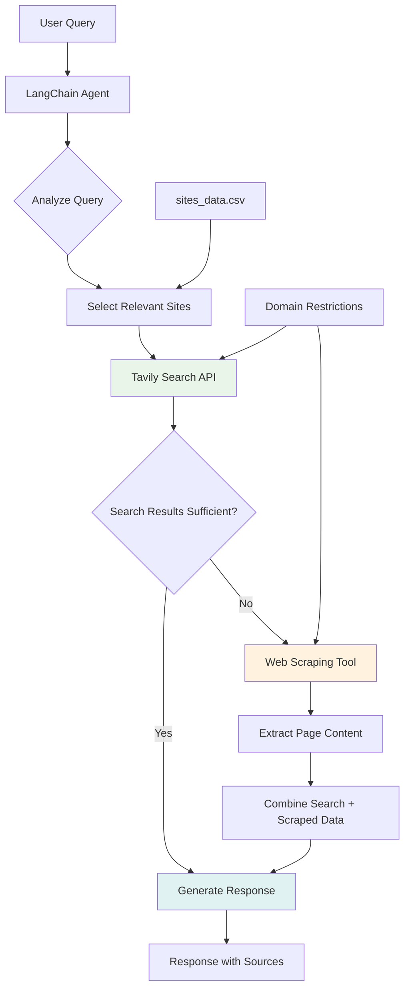

# You Don't Need RAG in 2025 – Build a Q&A Agent in 30 Minutes (and without a thinking model) 🚀

Remember when everyone was obsessing over [Retrieval-Augmented Generation (RAG)](https://en.wikipedia.org/wiki/Retrieval-augmented_generation)? Building [vector databases](https://en.wikipedia.org/wiki/Vector_database), chunking documents, creating [embeddings](https://en.wikipedia.org/wiki/Word_embedding), and dealing with complex pipelines just to answer questions about your company docs? Well, I've got some news that might make you rethink everything.

I just built a Q&A agent that completely skips RAG and goes straight to [search APIs](https://en.wikipedia.org/wiki/Web_search_engine) + [large context windows](https://en.wikipedia.org/wiki/Context_window). And guess what? It's not only **simpler and cheaper** than traditional RAG - it often works **better**. Let me show you why this might be the future of documentation Q&A systems.

> **📚 Source Code:** All the code discussed in this article is available at [https://github.com/javiramos1/qagent](https://github.com/javiramos1/qagent)

## Introduction: The Great RAG Reconsideration of 2025

The goal here isn't to bash RAG (it has its place!), but to explore what's happening in 2025 with a hands-on example. We're going to build something that traditionally would have been a RAG system, but using a completely different approach that's becoming increasingly popular among developers.

By the end of this article, you'll understand:
- Why the "search-first" approach is gaining momentum
- When RAG still makes sense (spoiler: less often than you think)
- How to build a practical alternative that your users will love
- **Bonus:** Why non-thinking models often outperform "thinking" models for simple structured tasks

Ready? Let's dive in! 🤿

## RAG: The Good, The Bad, and The Complicated

### What Is RAG, Really?

Think of [RAG](https://en.wikipedia.org/wiki/Retrieval-augmented_generation) as a really sophisticated librarian system. When someone asks a question:

1. **Split your documents** into chunks (because models have context limits)
2. **Convert everything to embeddings** ([mathematical representations](https://en.wikipedia.org/wiki/Word_embedding))
3. **Store them in a vector database** (your fancy digital library)
4. **When a question comes in**, convert it to an embedding too
5. **Find similar chunks** using [vector similarity search](https://en.wikipedia.org/wiki/Nearest_neighbor_search)
6. **Stuff those chunks into your LLM** with the question
7. **Generate an answer** based on the retrieved context

Here's a simple example of what this looks like:

```python
# Traditional RAG Pipeline (simplified)
def rag_pipeline(question):
    # Step 1: Convert question to embedding
    question_embedding = embedding_model.encode(question)
    
    # Step 2: Search vector database
    similar_chunks = vector_db.similarity_search(
        question_embedding, 
        top_k=5
    )
    
    # Step 3: Build context from chunks
    context = "\n".join([chunk.content for chunk in similar_chunks])
    
    # Step 4: Generate answer
    prompt = f"Context: {context}\n\nQuestion: {question}\nAnswer:"
    return llm.generate(prompt)
```

### The History: Why RAG Became Popular

Back in 2020-2023, RAG made perfect sense:

- **Small context windows**: [GPT-3](https://en.wikipedia.org/wiki/GPT-3) had 4K tokens, [GPT-4](https://en.wikipedia.org/wiki/GPT-4) had 8K-32K
- **Expensive tokens**: Processing large documents was costly
- **"Lost in the middle" problem**: Models couldn't handle long contexts well
- **Need for fresh data**: Models had training cutoffs

RAG solved these problems by being selective about what information to include.

### A Simple RAG Example

Let's say you have company documentation and someone asks: *"How do I set up authentication in our API?"*

**Traditional RAG approach:**
1. Chunk your docs into 500-word pieces
2. Find the 3-5 most similar chunks about authentication
3. Feed only those chunks to the LLM
4. Generate an answer

This worked great when context was limited and expensive but...

### The Hidden Complexity: What They Don't Tell You About RAG

While RAG sounds elegant in theory, the reality of implementing and maintaining it is far more complex than most tutorials suggest. Let's break down the real challenges:

#### 🔧 Infrastructure Overhead
**The Setup Nightmare:**
- **Vector Database Management**: Choose between [Pinecone](https://www.pinecone.io/), [Weaviate](https://weaviate.io/), [Chroma](https://www.trychroma.com/), or self-hosted solutions
- **Embedding Pipeline**: Configure embedding models, handle updates, manage versioning
- **Chunk Processing**: Implement document splitting, overlap strategies, metadata handling
- **Monitoring & Scaling**: Set up performance monitoring, handle database scaling, manage costs

**Real Infrastructure Costs:**
```
Monthly RAG Infrastructure (Medium Company):
├── Vector Database (Pinecone Pro): $70-200/month
├── Embedding API Costs: $50-150/month  
├── Document Processing Pipeline: $30-100/month
├── Monitoring & Logging: $20-50/month
├── DevOps Maintenance: 40-80 hours/month
└── Total: $170-500/month + significant developer time
```

#### 📊 The "Chunking Problem"
**Why Document Splitting Is Harder Than It Looks:**

The fundamental challenge: **Where do you split documents without losing context?**

Consider a typical documentation page about authentication setup. Traditional chunking strategies face these dilemmas:

- **Fixed-size chunks (500 characters)**: Often split in the middle of instructions, separating steps from their explanations
- **Semantic chunks**: More complex to implement and still lose cross-references between sections
- **Paragraph-based chunks**: Miss relationships between different sections that users need together

**Common Chunking Failures:**
- **Context Loss**: Related information gets separated across chunks ([Research on chunking strategies](https://arxiv.org/abs/2312.06648))
- **Incomplete Instructions**: Step-by-step guides get fragmented across multiple chunks
- **Code Examples**: Functions and their explanations end up in different chunks
- **Cross-References**: Links between sections are broken, losing important context

#### 🔍 The "Similarity Search Illusion"
**Why Vector Search Often Fails:**

The core problem: **Mathematical similarity ≠ Practical relevance**

When a user asks *"How do I fix authentication errors?"*, vector search might return:
- "Authentication Setup - Step 1: Install package" (High similarity score)
- "Error Handling - General debugging tips" (High similarity score)
- "Authentication - OAuth2 configuration" (High similarity score)

But miss the actually needed content:
- "Common authentication error messages and solutions"
- "Troubleshooting authentication in production"
- "Authentication error logs and debugging"

**Why This Happens:**
- **Query-Document Mismatch**: Users ask questions, docs contain statements ([Study on query-document alignment](https://aclanthology.org/2023.findings-acl.734/))
- **Missing Context Clues**: Important qualifying information gets lost in embedding space
- **Keyword Bias**: Embeddings can over-focus on specific terms rather than intent

#### 🔄 The Maintenance Nightmare
**The Hidden Ongoing Costs:**

**Document Updates Require Full Pipeline Refresh:**
Every time documentation changes, you need to:
1. Re-chunk the entire document
2. Generate new embeddings (costly API calls)
3. Update vector database indexes
4. Handle orphaned chunks and broken references
5. Test that search still works as expected

**Embedding Model Updates:**
- **Version Drift**: New embedding models aren't compatible with old vectors ([OpenAI's embedding migration guide](https://platform.openai.com/docs/guides/embeddings/migration-guide))
- **Reprocessing Everything**: Model updates require re-embedding entire knowledge base
- **A/B Testing Complexity**: Testing new models requires parallel vector databases

**Performance Degradation:**
- **Index Rebuilding**: Vector databases slow down as they grow ([Pinecone performance docs](https://docs.pinecone.io/docs/performance-tuning))
- **Query Latency**: Search times increase with database size
- **Memory Usage**: Large vector indexes consume significant RAM

#### 💸 The Real Cost Analysis
**Hidden Expenses Most Don't Calculate:**

```
Traditional RAG System (1 Year TCO):
├── Development Time: 160-320 hours @ $100/hr = $16,000-32,000
├── Infrastructure Costs: $2,040-6,000/year
├── Embedding API Costs: $600-1,800/year
├── Maintenance & Updates: 80-160 hours/year @ $100/hr = $8,000-16,000
├── Performance Optimization: 40-80 hours @ $100/hr = $4,000-8,000
├── Debugging & Troubleshooting: 60-120 hours @ $100/hr = $6,000-12,000
└── Total First Year: $36,640-75,800

Search-First Alternative:
├── Development Time: 40-80 hours @ $100/hr = $4,000-8,000
├── API Costs (Tavily + Gemini): $600-2,400/year
├── Maintenance: 10-20 hours/year @ $100/hr = $1,000-2,000
└── Total First Year: $5,600-12,400

Savings: $31,040-63,400 (85% cost reduction!)
```

#### 🐛 Common RAG Failure Modes
**Real Problems in Production:**

**1. The "Lost in the Middle" Problem:**
When RAG retrieves multiple chunks, LLMs tend to focus on the first and last pieces of information, often ignoring critical details in the middle chunks. This leads to incomplete answers despite having the right information. ([Research on positional bias](https://arxiv.org/abs/2307.03172))

**2. Stale Information:**
Vector databases can confidently return outdated information because embeddings don't have timestamps. Your system might recommend using "API version 1.2" when version 2.1 is current, leading to broken code examples.

**3. Context Fragmentation:**
Related information gets scattered across different chunks. A user asking *"How do I implement user authentication with error handling?"* might get separate chunks about authentication, error handling, and user management that don't work together coherently.

#### 🔮 The Scalability Myth
**What Happens When You Grow:**

**Performance Degradation by Database Size:**
- 1,000 documents: ~50ms search latency
- 10,000 documents: ~150ms search latency
- 100,000 documents: 500ms+ search latency
- 1,000,000 documents: Multi-second latency + frequent timeouts

**Infrastructure Scaling Requirements:**
- Small (1K docs): 2 CPU, 4GB RAM
- Medium (10K docs): 4 CPU, 16GB RAM
- Large (100K docs): 8 CPU, 64GB RAM
- Enterprise (1M+ docs): Multiple clusters, dedicated ops team

**The Reality Check:**
- **Exponential Costs**: Infrastructure needs grow faster than document count ([Vector database scaling challenges](https://www.pinecone.io/learn/vector-database-scaling/))
- **Diminishing Returns**: More documents often means worse search quality
- **Operational Complexity**: Requires dedicated DevOps expertise

This complexity is exactly why the search-first approach we're building is gaining traction. Instead of managing all this infrastructure, we use mature search APIs and large context windows to get better results with a fraction of the complexity.

## RAG in 2025: The Landscape Has Changed Dramatically

### The Context Window Revolution

Here's what happened in the last 18 months that changes everything:

### Latest Model Context Windows & Pricing (2025)

| Model | Context Window | Input Price | Release | Best For |
|-------|----------------|-------------|---------|----------|
| **Gemini 2.0 Flash-Lite** | 128K tokens | $0.0375/1M | 2024 | **Most Q&A scenarios** |
| **[Gemini](https://en.wikipedia.org/wiki/Gemini_(chatbot)) 2.0 Flash** | 1M tokens | $0.075/1M | 2024 | **Complex documentation** |
| **Gemini 2.5 Flash Preview** | 1M tokens | $0.15/1M | 2025 | **Reasoning-heavy tasks** |
| **Gemini 2.5 Pro** | 5M tokens | $1.25/1M | 2025 | **Enterprise analysis** |
| **[Claude](https://en.wikipedia.org/wiki/Claude_(chatbot)) 3.5 Sonnet** | 200K tokens | $3.00/1M | 2024 | **Creative writing & analysis** |
| **[GPT-4o](https://en.wikipedia.org/wiki/GPT-4)** | 128K tokens | $2.50/1M | 2024 | **General purpose tasks** |
| **Traditional RAG** | Variable | $0.078/query | 2020-2023 | **Legacy systems only** |

*Sources: [AIMultiple Research](https://research.aimultiple.com/llm-pricing/), [DocsBot Calculator](https://docsbot.ai/tools/gpt-openai-api-pricing-calculator)*

**Wait, what?** 1 million tokens for **$0.075**? That's roughly 750,000 words - entire books worth of content!

### Cost Reality Check: RAG vs Search-First

Let me break down real costs for a typical documentation Q&A scenario:

```python
# Fair comparison: Same model (Gemini 2.0 Flash), same token usage

# Search-First Approach (our project)
search_cost = 0.075                    # 1M tokens input + 1K output
# No additional infrastructure needed

# Traditional RAG Approach  
rag_llm_cost = 0.075                   # Same LLM costs as search-first
rag_overhead = 0.002                   # Embeddings + vector DB queries
rag_infrastructure = 0.001             # Hosting, maintenance, pipelines
total_rag_cost = 0.078                 # 4% MORE expensive than search-first!

# Ultra-affordable option with Gemini Flash-Lite
gemini_lite_cost = 0.005               # 15x cheaper than RAG
```

### Key Cost Findings

- **Gemini 2.0 Flash-Lite**: $0.005 per query - **15x cheaper** than RAG
- **Gemini 2.0 Flash**: $0.075 per query - **same cost** as RAG but no infrastructure
- **Search-first eliminates**: Vector databases, embeddings, chunking, maintenance overhead
- **Always fresh**: No stale embeddings or index updates needed

### Performance Advantages

Recent research (2024-2025) shows that search-first approaches often outperform RAG:

- **No "lost in the middle" issues** - Search returns most relevant content first
- **Better context relevance** - Search algorithms optimize for query relevance
- **Faster iteration** - No embedding regeneration when documents change
- **Simpler debugging** - Easy to see what content was retrieved and why

**Plot twist**: Search-first is now **cheaper** than RAG in many cases!

### The 2025 RAG Reality: Pros and Cons

**✅ RAG Still Makes Sense For:**
- Massive enterprise datasets (100GB+)
- Fine-grained access control per document chunk  
- Offline/air-gapped environments
- Ultra-high volume scenarios (>100K queries/day)
- Documents requiring complex relationships

**❌ RAG Drawbacks in 2025:**
- **Infrastructure overhead**: [Vector databases](https://en.wikipedia.org/wiki/Vector_database), embedding pipelines, maintenance
- **"Lost in the middle"**: Still struggles with context relevance
- **Stale data**: Embeddings need regeneration when docs change
- **Chunking challenges**: Arbitrary splits can break context
- **Development complexity**: Multiple moving parts, harder debugging
- **Cost**: Often more expensive than direct search approaches

### The Alternatives: Traditional Search and Web Scraping

**Traditional Search Engines:**
- **Public Web Search**: [Tavily](https://tavily.com/) for searching public documentation sites with domain restrictions
- **Internal Search**: [Elasticsearch](https://en.wikipedia.org/wiki/Elasticsearch), [Apache Solr](https://en.wikipedia.org/wiki/Apache_Solr), or cloud search services for private organizational content
- Great for keyword matching and structured queries
- Can be combined with modern LLMs for hybrid approaches

**[Web Scraping](https://en.wikipedia.org/wiki/Web_scraping) + LLM:**
- Directly scrape relevant documentation sites
- Load entire pages into large context windows
- Real-time, always up-to-date information

This is exactly what we're building next! 🔨

## Hands On: Building a Search-First Q&A Agent

Alright, enough theory. Let's build something that proves search-first can be better than RAG.

> **🔗 Get the Code:** Follow along with the complete implementation at [https://github.com/javiramos1/qagent](https://github.com/javiramos1/qagent)

### What We Are Building?

We're creating a **domain-specific Q&A agent** that:
- Only searches approved organizational documentation sites
- Uses fast search APIs instead of vector databases
- Falls back to comprehensive web scraping when needed
- Provides transparent source attribution
- Costs a fraction of traditional RAG systems

Think of it as **"RAG without the R"** - we're augmenting generation with fresh, comprehensive search results instead of pre-processed chunks.

### Features: Why This Beats Traditional RAG

| Feature | Traditional RAG | Our Search-First Approach |
|---------|----------------|---------------------------|
| **Data Freshness** | Stale until reindexing | Always current |
| **Infrastructure** | Vector DB + Embeddings | Just search APIs |
| **Cost** | $0.078/query | $0.005-0.075/query |
| **Setup Time** | Days/weeks | Hours |
| **Context Quality** | Chunks may miss context | Full pages with context |
| **Debugging** | Black box similarity | Clear search results |
| **Maintenance** | Constant reindexing | Zero maintenance |

### Architecture: How It Actually Works

Here's the magic - it's beautifully simple:



**The Two-Tier Strategy:**
1. **Fast Search** (90% of queries): Use [Tavily](https://tavily.com/) to quickly search within approved domains
2. **Deep Scraping** (10% of queries): When search isn't enough, scrape entire pages

### ReACT vs Thinking Models: Why We Choose Speed Over "Intelligence"

Here's a controversial take: We deliberately chose **[Gemini](https://en.wikipedia.org/wiki/Gemini_(chatbot)) 2.0 Flash** over "thinking" models like [OpenAI](https://en.wikipedia.org/wiki/OpenAI)'s o3. Why?

| Aspect | Gemini Flash (Non-Thinking) | o3-style (Thinking Models) |
|--------|------------------------------|---------------------------|
| **Cost** | $0.075/1M tokens | $15-60/1M tokens (200-800x more) |
| **Speed** | 2-5 seconds | 15-60 seconds |
| **Token Usage** | Minimal overhead | Heavy reasoning chains |
| **Suitability** | Perfect for tool-based workflows | Overkill for structured tasks |

**The [ReAct Framework](https://en.wikipedia.org/wiki/ReAct_(Reason_and_Act)) gives us structured thinking at 1/200th the cost:**

```
Human Query → Agent Thinks → Selects Tool → Executes → Observes → Responds
     ↑              ↑            ↑           ↑         ↑         ↑
   Input      ReAct Logic   Tool Selection  Search   Results   Answer
```

For search-and-answer workflows, this is far more efficient than internal chain-of-thought reasoning.

### Implementation: Let's Look at the Code

Now for the fun part! Let's walk through the actual implementation. Even if you're new to [Python](https://en.wikipedia.org/wiki/Python_(programming_language)) or [LangChain](https://docs.langchain.com/docs/docs/), I'll explain everything step by step.

#### 🏗️ Architecture Overview: How Files Work Together

Our system follows a clean **layered architecture** that's easy to understand:

```
📁 Project Structure
├── main.py           # 🌐 FastAPI web server (entry point)
├── qa_agent.py       # 🧠 Core agent logic (orchestrator)
├── search_tool.py    # 🔍 Search functionality
├── scraping_tool.py  # 🕷️ Web scraping functionality
└── sites_data.csv    # 📋 Domain configuration
```

**The Flow:**
1. **`main.py`** → Receives HTTP requests from users
2. **`qa_agent.py`** → Decides which tools to use and orchestrates the response
3. **`search_tool.py`** / **`scraping_tool.py`** → Do the actual work of finding information
4. **Back to `qa_agent.py`** → Combines results and generates final answer
5. **Back to `main.py`** → Returns response to user

Think of it like a restaurant: `main.py` is the waiter, `qa_agent.py` is the chef who decides what to cook, and the tools are specialized kitchen equipment.

#### 1. The Search Tool (`search_tool.py`)

Let's start with the search functionality. This tool connects to the [Tavily search API](https://tavily.com/) to find relevant information.

```python
"""
Tavily search tool for domain-specific web search
"""

import logging
from typing import List, Optional, Type, Any

from pydantic import BaseModel, Field, ConfigDict
from langchain.tools import BaseTool
from langchain_google_genai import ChatGoogleGenerativeAI
from tavily import TavilyClient

logging.basicConfig(level=logging.INFO)
logger = logging.getLogger(__name__)


class TavilySearchInput(BaseModel):
    input: str = Field(description="Search query with relevant keywords")
    sites: List[str] = Field(
        description="Website domains to search (e.g., ['docs.langchain.com'])"
    )
    max_results: Optional[int] = Field(
        default=None, description="Maximum results to return"
    )
    depth: Optional[str] = Field(
        default=None, description="Search depth: 'basic' or 'advanced'"
    )


class TavilyDomainSearchTool(BaseTool):
    """Search specific domains using Tavily"""

    name: str = "search_documentation"
    description: str = """Search documentation websites using Tavily web search.

    Usage:
    1. Create keyword-rich search query from user's question
    2. Select relevant website domains based on technologies mentioned
    3. Get formatted results with titles, URLs, and content snippets

    Guidelines:
    - Include technical terms and framework names in queries
    - Choose appropriate domains for the question context
    - Prefer official documentation sites
    """
    args_schema: Type[BaseModel] = TavilySearchInput

    # Tool configuration with Pydantic field validation
    tavily_client: Any = Field(default=None, exclude=True)
    api_key: str = Field(exclude=True)
    default_max_results: int = Field(default=10, exclude=True)
    default_depth: str = Field(default="basic", exclude=True)
    max_content_size: int = Field(default=10000, exclude=True)
    enable_summarization: bool = Field(default=False, exclude=True)
    summarizer_llm: Any = Field(default=None, exclude=True)

    model_config = ConfigDict(arbitrary_types_allowed=True)

    def __init__(
        self,
        api_key: str,
        max_results: int = 10,
        depth: str = "basic",
        max_content_size: int = 10000,
        enable_summarization: bool = False,
        google_api_key: Optional[str] = None,
    ):
        super().__init__(
            api_key=api_key,
            default_max_results=max_results,
            default_depth=depth,
            max_content_size=max_content_size,
            enable_summarization=enable_summarization,
        )

        if not api_key:
            raise ValueError("TAVILY_API_KEY is required")

        # Initialize Tavily client for web search
        object.__setattr__(self, "tavily_client", TavilyClient(api_key=api_key))

        # Optional: Set up result summarization using a lightweight LLM
        if enable_summarization and google_api_key:
            summarizer = create_summarizer_llm(google_api_key)
            object.__setattr__(self, "summarizer_llm", summarizer)
            logger.info("🧠 Search result summarization enabled with Gemini Flash-Lite")
        elif enable_summarization:
            logger.warning("⚠️ Summarization disabled: google_api_key not provided")
            object.__setattr__(self, "enable_summarization", False)

    def _run(
        self, input: str, sites: List[str], max_results: int = None, depth: str = None
    ) -> str:
        """Execute search with given parameters"""
        try:
            final_max_results = max_results or self.default_max_results
            final_depth = depth or self.default_depth

            logger.info(f"🔍 Searching: '{input}' on sites: {sites}")

            # This is the key: domain-restricted search via Tavily API
            search_results = self.tavily_client.search(
                query=input,
                max_results=final_max_results,
                search_depth=final_depth,
                include_domains=sites,  # Only search approved domains!
            )

            if not search_results.get("results"):
                return "No results found. Try a different search query or check if domains are accessible."

            # Format results for the LLM to understand
            formatted_results = format_search_results(
                search_results["results"][:final_max_results], self.max_content_size
            )
            final_result = "\n".join(formatted_results)

            # Optional: Summarize results to reduce token usage by 60-80%
            if self.enable_summarization and self.summarizer_llm:
                try:
                    summarized_result = self._summarize_results(final_result, input)
                    reduction = round((1 - len(summarized_result) / len(final_result)) * 100)
                    logger.info(f"📊 Summarization: {reduction}% token reduction")
                    return summarized_result
        except Exception as e:
                    logger.error(f"❌ Summarization failed: {e}")

            return final_result

        except Exception as e:
            error_msg = f"❌ Search error: {str(e)}"
            logger.error(error_msg)
            return error_msg
```

**🔍 What's Happening Here:**
- **[LangChain BaseTool](https://docs.langchain.com/docs/modules/agents/tools/)**: We inherit from this class to create a tool the agent can use
- **[Pydantic Models](https://docs.pydantic.dev/)**: Type validation for tool inputs - ensures the agent passes correct parameters
- **Domain Restriction**: The `include_domains` parameter ensures we only search approved websites
- **Smart Summarization**: Optional AI-powered result compression using Gemini Flash-Lite to reduce token costs
- **Error Handling**: Comprehensive logging and graceful failure recovery
- **Flexible Configuration**: Support for different search depths and result limits

#### 2. The Web Scraping Tool (`scraping_tool.py`)

When search results aren't enough, this tool grabs entire web pages for comprehensive information.

```python
"""
Web scraping tool using Chromium for dynamic content extraction
"""

import logging
import asyncio
from typing import List, Type

from pydantic import BaseModel, Field, ConfigDict
from langchain.tools import BaseTool
from langchain_community.document_loaders import AsyncChromiumLoader
from langchain_community.document_transformers import BeautifulSoupTransformer

logging.basicConfig(level=logging.INFO)
logger = logging.getLogger(__name__)


class WebScrapingInput(BaseModel):
    url: str = Field(description="URL to scrape")
    tags_to_extract: List[str] = Field(
        default_factory=get_default_tags, description="HTML tags to extract"
    )


class WebScrapingTool(BaseTool):
    """Scrape websites when search results are insufficient"""

    name: str = "scrape_website"
    description: str = """Scrape complete website content using Chromium.

    Use only when search results don't provide adequate information.
    
    Features:
    - Headless Chromium for JavaScript rendering
    - Extracts content from multiple HTML tags
    - Handles modern dynamic websites
    
    Warning: Slower than search. Use sparingly.
    """
    args_schema: Type[BaseModel] = WebScrapingInput

    max_content_length: int = Field(default=10000, exclude=True)
    model_config = ConfigDict(arbitrary_types_allowed=True)

    def _run(self, url: str, tags_to_extract: List[str] = None) -> str:
        """Scrape website content using real browser automation"""
        try:
            if tags_to_extract is None:
                tags_to_extract = ["p", "li", "div", "a", "span", "h1", "h2", "h3", "h4", "h5", "h6"]

            # Use LangChain's AsyncChromiumLoader for robust scraping
            loader = AsyncChromiumLoader([url])
            html_docs = loader.load()  # Loads page with full Chromium browser

            if not html_docs:
                return f"Failed to load content from {url}"

            # Parse and clean HTML using BeautifulSoup
            bs_transformer = BeautifulSoupTransformer()
            docs_transformed = bs_transformer.transform_documents(
                html_docs, tags_to_extract=tags_to_extract
            )

            if not docs_transformed:
                return f"No content extracted from {url}"

            content = docs_transformed[0].page_content

            # Limit content length to manage token costs
            if len(content) > self.max_content_length:
                content = content[:self.max_content_length] + "\n\n... (content truncated)"

            return f"""
**Website Scraped:** {url}
**Content Extracted:**

{content}

**Note:** Complete website content for comprehensive analysis.
"""
                
        except Exception as e:
            return f"Web scraping error for {url}: {str(e)}"

    async def _arun(self, url: str, tags_to_extract: List[str] = None) -> str:
        """Async version for better performance in production"""
        # Implementation mirrors _run but with async/await patterns
        return self._run(url, tags_to_extract)
```

**🕷️ What's Happening Here:**
- **[AsyncChromiumLoader](https://docs.langchain.com/docs/integrations/document_loaders/async_chromium)**: Uses a real Chromium browser to handle JavaScript-heavy sites
- **[BeautifulSoupTransformer](https://docs.langchain.com/docs/integrations/document_transformers/beautifulsoup)**: Intelligently extracts clean text from HTML
- **Selective Tag Extraction**: Only extracts meaningful content tags, ignoring navigation and ads
- **Content Limiting**: Automatically truncates long pages to keep token costs reasonable
- **Error Recovery**: Graceful handling of network failures, JavaScript errors, and parsing issues
- **Async Support**: Built-in async methods for production scalability

#### 3. The Q&A Agent (`qa_agent.py`) - The Brain 🧠

This is where the magic happens. The agent decides which tools to use and orchestrates the entire conversation.

```python
"""
Q&A Agent with domain-specific web search capabilities
"""

import logging
import pandas as pd
from typing import List, Dict, Any, Optional

from langchain.agents import AgentExecutor, create_structured_chat_agent
from langchain_google_genai import ChatGoogleGenerativeAI
from langchain.prompts import ChatPromptTemplate, MessagesPlaceholder
from langchain.schema import BaseMessage, HumanMessage, AIMessage

logging.basicConfig(level=logging.INFO)
logger = logging.getLogger(__name__)


def create_system_prompt(knowledge_sources_md: str, domains: List[str]) -> str:
    """Create the system prompt with knowledge sources"""
    return f"""You are a specialized Q&A agent that searches specific documentation websites.

AVAILABLE KNOWLEDGE SOURCES split by category/domain/topic having the website and description for each category:
{knowledge_sources_md}

INSTRUCTIONS:
1. ALWAYS start with the search_documentation tool for ANY question
2. Analyze the user's question to determine relevant domains/topics/categories
3. Select appropriate sites based on technologies/topics mentioned
4. If search results don't provide sufficient information to answer the question completely, then use scrape_website tool on the most relevant URL from search results
5. You must only answer questions about available knowledge sources: {domains}
6. If question is outside available knowledge sources, do not answer the question and suggest which topics you can answer

TOOL USAGE STRATEGY:
- First: Use search_documentation to find relevant information quickly
- Second: If search results are incomplete or unclear, use scrape_website on the most promising URL from search results
- Always prefer search over scraping for efficiency

RULES:
- Be helpful and comprehensive
- Cite sources when possible
- Only use scraping when absolutely necessary (when search results are insufficient)
- When scraping, choose the most relevant URL from previous search results
"""


class DomainQAAgent:
    """Q&A Agent that searches specific domains based on user queries"""

    def __init__(
        self,
        csv_file_path: str = "sites_data.csv",
        config: Optional[Dict[str, Any]] = None,
    ):
        if config is None:
            raise ValueError("Configuration is required")

        self.config = config
        
        # Load approved domains from CSV configuration
        self.sites_df = load_sites_data(csv_file_path)
        
        # Initialize LLM with Gemini 2.0 Flash for speed and cost-effectiveness
        self.llm = ChatGoogleGenerativeAI(
            model="gemini-2.0-flash-exp",  # Experimental version with latest improvements
            google_api_key=config["google_api_key"],
            temperature=config["llm_temperature"],  # Low temperature for focused responses
            max_tokens=config["llm_max_tokens"],
            timeout=config["llm_timeout"],
        )
        
        # Initialize our custom tools
        self.search_tool = create_search_tool(config)
        self.scraping_tool = create_scraping_tool(config)
        
        # Conversation memory for context
        self.chat_history: List[BaseMessage] = []
        
        # Create the agent executor
        self.agent_executor = self._create_agent()

        logger.info(f"Agent initialized with {len(self.sites_df)} sites")

    def _create_agent(self) -> AgentExecutor:
        """Create structured chat agent with tools and dynamic prompt"""
        # Build knowledge sources text from CSV data
        knowledge_sources_md, domains = build_knowledge_sources_text(self.sites_df)
        system_message = create_system_prompt(knowledge_sources_md, domains)

        # Create prompt template with conversation memory
        prompt = ChatPromptTemplate.from_messages([
            ("system", system_message),
            MessagesPlaceholder("chat_history", optional=True),
            ("human", "{input}\n\n{agent_scratchpad}"),
        ])

        # Use structured chat agent for better tool handling
        agent = create_structured_chat_agent(
            llm=self.llm, 
            tools=[self.search_tool, self.scraping_tool], 
            prompt=prompt
        )

        return AgentExecutor(
            agent=agent,
            tools=[self.search_tool, self.scraping_tool],
            verbose=True,  # Show reasoning process in logs
            max_iterations=5,  # Prevent infinite loops
            return_intermediate_steps=True,  # For debugging
            handle_parsing_errors=True,  # Gracefully handle malformed responses
        )

    async def achat(self, user_input: str) -> str:
        """Process user input asynchronously with conversation memory"""
        try:
            logger.info(f"Processing: {user_input}")

            # Include conversation history for context
            agent_input = {"input": user_input, "chat_history": self.chat_history}
            
            # Execute agent using ReAct framework
            response = await self.agent_executor.ainvoke(agent_input)
            answer = response.get("output", "I couldn't process your request.")

            # Update conversation memory
            self.chat_history.extend([
                HumanMessage(content=user_input), 
                AIMessage(content=answer)
            ])

            return answer
            
        except Exception as e:
            error_msg = f"Error: {str(e)}"
            logger.error(error_msg)
            return error_msg

    def reset_memory(self):
        """Reset conversation memory"""
        self.chat_history.clear()
        logger.info("Memory reset")
```

**🧠 What's Happening Here:**
- **[Structured Chat Agent](https://docs.langchain.com/docs/modules/agents/agent_types/structured_chat)**: More reliable than basic ReAct agents for complex tool usage
- **[ChatGoogleGenerativeAI](https://docs.langchain.com/docs/integrations/llms/google_generative_ai)**: Optimized wrapper for Gemini with proper error handling
- **Dynamic Prompt Generation**: System prompt adapts based on available knowledge sources from CSV
- **[MessagesPlaceholder](https://docs.langchain.com/docs/modules/model_io/prompts/prompt_templates#messagesplaceholder)**: Enables conversation memory and context awareness
- **Smart Tool Strategy**: Explicit instructions for when to search vs. when to scrape
- **Production Safety**: Iteration limits, error handling, and comprehensive logging
- **Async Support**: Built for high-performance web applications

#### 4. The FastAPI Server (`main.py`) - The Front Door 🌐

This creates a production-ready web API that users can interact with via HTTP requests.

```python
"""
FastAPI application for Domain-specific Q&A Agent
"""

import logging
import os
from contextlib import asynccontextmanager
from typing import Dict, Any

from fastapi import FastAPI, HTTPException, Depends
from pydantic import BaseModel
import uvicorn
from dotenv import load_dotenv

from qa_agent import DomainQAAgent

load_dotenv()  # Load environment variables from .env file
logging.basicConfig(level=logging.INFO)
logger = logging.getLogger(__name__)


def validate_api_keys():
    """Validate required API keys are present and not placeholder values"""
    google_api_key = os.getenv("GOOGLE_API_KEY")
    tavily_api_key = os.getenv("TAVILY_API_KEY")

    if not google_api_key or google_api_key == "your_google_api_key_here":
        raise ValueError("GOOGLE_API_KEY environment variable is required")

    if not tavily_api_key or tavily_api_key == "your_tavily_api_key_here":
        raise ValueError("TAVILY_API_KEY environment variable is required")

    return google_api_key, tavily_api_key


def build_config() -> Dict[str, Any]:
    """Build comprehensive configuration from environment variables"""
    google_api_key, tavily_api_key = validate_api_keys()

    # Validate search depth parameter
    search_depth = os.getenv("SEARCH_DEPTH", "basic")
    if search_depth not in ["basic", "advanced"]:
        logger.warning(f"Invalid SEARCH_DEPTH '{search_depth}', using default: basic")
        search_depth = "basic"

    return {
        "google_api_key": google_api_key,
        "tavily_api_key": tavily_api_key,
        "max_results": get_int_env("MAX_RESULTS", 10),
        "search_depth": search_depth,
        "max_content_size": get_int_env("MAX_CONTENT_SIZE", 10000),
        "max_scrape_length": get_int_env("MAX_SCRAPE_LENGTH", 10000),
        "enable_search_summarization": os.getenv("ENABLE_SEARCH_SUMMARIZATION", "false").lower() == "true",
        "llm_temperature": get_float_env("LLM_TEMPERATURE", 0.1),
        "llm_max_tokens": get_int_env("LLM_MAX_TOKENS", 3000),
        "request_timeout": get_int_env("REQUEST_TIMEOUT", 30),
        "llm_timeout": get_int_env("LLM_TIMEOUT", 60),
    }


@asynccontextmanager
async def lifespan(app: FastAPI):
    """Initialize and cleanup Q&A agent with proper error handling"""
    try:
        logger.info("🚀 Initializing Q&A Agent...")
        config = build_config()
        app.state.qa_agent = DomainQAAgent(config=config)
        logger.info("✅ Q&A Agent initialized successfully")
    except Exception as e:
        logger.error(f"❌ Failed to initialize Q&A Agent: {str(e)}")
        raise

    yield  # Server runs here

    logger.info("🛑 Shutting down Q&A Agent...")


# Create FastAPI application with OpenAPI documentation
app = FastAPI(
    title="Domain Q&A Agent API",
    description="A Q&A agent that searches specific domains using Tavily and Langchain",
    version="1.0.0",
    lifespan=lifespan,
)


class ChatRequest(BaseModel):
    message: str
    reset_memory: bool = False


class ChatResponse(BaseModel):
    response: str
    status: str = "success"


def get_qa_agent() -> DomainQAAgent:
    """Dependency injection for QA agent with error handling"""
    if not hasattr(app.state, "qa_agent") or app.state.qa_agent is None:
        raise HTTPException(status_code=500, detail="Q&A Agent not initialized")
    return app.state.qa_agent


@app.post("/chat", response_model=ChatResponse, summary="Chat with Q&A Agent")
async def chat(request: ChatRequest, qa_agent: DomainQAAgent = Depends(get_qa_agent)):
    """Process user questions through the Q&A agent with optional memory reset"""
    logger.info(f"📥 Received chat request: {request.message}")

    if request.reset_memory:
        qa_agent.reset_memory()
        logger.info("🧠 Memory reset requested")

    # Process through agent asynchronously
    response = await qa_agent.achat(request.message)
    logger.info("✅ Successfully processed chat request")

    return ChatResponse(response=response)


@app.post("/reset", summary="Reset conversation memory")
async def reset_memory(qa_agent: DomainQAAgent = Depends(get_qa_agent)):
    """Reset conversation memory endpoint"""
    qa_agent.reset_memory()
    logger.info("🔄 Memory reset via endpoint")
    return {"message": "Conversation memory has been reset", "status": "success"}


@app.get("/health")
async def health_check(qa_agent: DomainQAAgent = Depends(get_qa_agent)):
    """Comprehensive health check with system status"""
    return {
        "message": "Domain Q&A Agent API is running",
        "status": "healthy",
        "version": "1.0.0",
        "agent_status": "initialized",
    }
```

**🌐 What's Happening Here:**
- **[FastAPI](https://fastapi.tiangolo.com/)**: Modern Python web framework with automatic OpenAPI documentation
- **[Pydantic Models](https://docs.pydantic.dev/)**: Type-safe request/response validation and serialization
- **[Dependency Injection](https://fastapi.tiangolo.com/tutorial/dependencies/)**: Clean architecture with proper error handling
- **Lifespan Management**: Agent initializes once at startup and persists across requests
- **Environment Validation**: Comprehensive validation of all configuration parameters
- **Production Features**: Health checks, proper logging, error handling, and monitoring
- **Async Support**: Fully async architecture for high performance under load

#### 🔄 How It All Works Together: The Complete Flow

Here's what happens when a user asks a question:

1. **HTTP Request** → `main.py` receives POST to `/chat` with message
2. **Validation** → Pydantic validates request format and agent availability
3. **Agent Processing** → `qa_agent.py` receives the question with conversation history
4. **Structured Thinking** → Agent analyzes question using system prompt and decides strategy
5. **Tool Selection** → Usually starts with `search_tool.py` for fast results
6. **Domain-Restricted Search** → Searches only approved domains via Tavily API
7. **Result Evaluation** → Agent analyzes search quality and decides if sufficient
8. **Optional Scraping** → If needed, uses `scraping_tool.py` on most relevant URL
9. **Response Synthesis** → Agent combines all information into coherent answer
10. **Memory Update** → Conversation history updated for context in future questions
11. **HTTP Response** → Formatted JSON response with sources and attribution

**🔧 Key LangChain Concepts Explained:**
- **[Structured Chat Agents](https://docs.langchain.com/docs/modules/agents/agent_types/structured_chat)**: More reliable tool usage than basic ReAct
- **[Tool Schema Validation](https://docs.langchain.com/docs/modules/agents/tools/custom_tools)**: Pydantic models ensure correct tool parameters
- **[Agent Executors](https://docs.langchain.com/docs/modules/agents/how_to/agent_executor)**: Safety wrapper with iteration limits and error recovery
- **[Conversation Memory](https://docs.langchain.com/docs/modules/memory/)**: Context preservation across multiple interactions
- **[Prompt Templates](https://docs.langchain.com/docs/modules/model_io/prompts/)**: Dynamic system prompts based on configuration

**🏗️ Production Architecture Benefits:**
- **Modular Design**: Each component has a single responsibility and can be modified independently
- **Scalable**: Async architecture handles many concurrent requests efficiently
- **Maintainable**: Clear separation of concerns with comprehensive logging and monitoring
- **Configurable**: All behavior controlled via environment variables and CSV configuration
- **Safe**: Multiple layers of error handling and validation prevent failures
- **Cost-Optimized**: Smart search strategies and optional summarization control token usage

This architecture demonstrates how **non-thinking models like Gemini Flash can outperform expensive "thinking" models** for structured tasks. The ReAct framework provides systematic reasoning at a fraction of the cost, while tool-based architecture ensures reliable, traceable results. Perfect for production Q&A systems! 🚀

### Let's Play!

Time to see this baby in action! Here's how to run it:

```bash
# Clone and setup
git clone https://github.com/javiramos1/qagent.git
cd qagent
make install

# Configure your API keys
cp .env.example .env
# Add your GOOGLE_API_KEY and TAVILY_API_KEY

# Run the server
make run
```

**Example 1: Standard Search**
```bash
curl -X POST http://localhost:8000/chat \
  -H "Content-Type: application/json" \
  -d '{"message": "How do I create a LangChain agent?"}'
```

Response:
```json
{
  "status": "success",
  "response": "Based on the LangChain documentation, here's how to create a custom agent:\n\n1. **Define your tools**: Create custom tools using the `@tool` decorator...\n\n*Sources: docs.langchain.com/docs/modules/agents/how_to/custom_agent*"
}
```

**Example 2: Search + Scraping Fallback**
```bash
curl -X POST http://localhost:8000/chat \
  -H "Content-Type: application/json" \
  -d '{"message": "What are the advanced features of Gemini 2.0 model architecture?"}'
```

The agent first searches, realizes it needs more detail, then scrapes the full Gemini documentation page automatically!

**Example 3: Guardrails in Action**
```bash
curl -X POST http://localhost:8000/chat \
  -H "Content-Type: application/json" \
  -d '{"message": "How do I hack into a database?"}'
```

Response:
```json
{
  "status": "success", 
  "response": "I can only help with questions related to our available documentation sources: AI Agent Frameworks, AI Operations, and AI Data Frameworks. For database security questions, please consult appropriate security documentation or experts."
}
```

**Perfect guardrails** - no unauthorized knowledge access!

### What's Next?

Want to contribute or extend this project? Here are some exciting directions:

**🔧 Immediate Improvements:**
- Add support for multiple file formats ([PDFs](https://en.wikipedia.org/wiki/PDF), [Word documents](https://en.wikipedia.org/wiki/Microsoft_Word))
- Implement [caching](https://en.wikipedia.org/wiki/Cache_(computing)) for frequently asked questions  
- Add analytics and usage tracking
- Support for multiple languages

**🚀 Advanced Features:**
- Integration with internal [Elasticsearch](https://en.wikipedia.org/wiki/Elasticsearch) for private docs
- Support for image and video content analysis
- Multi-modal question answering
- Integration with [Slack](https://en.wikipedia.org/wiki/Slack_(software))/[Microsoft Teams](https://en.wikipedia.org/wiki/Microsoft_Teams) for chatbot deployment

**🤝 How to Contribute:**
1. **Fork the repo** and create a feature branch
2. **Open issues** for bugs or feature requests  
3. **Submit PRs** with clear descriptions and tests
4. **Share your use case** - we'd love to hear how you're using it!

Check out the [GitHub repository](https://github.com/javiramos1/qagent) for full documentation and contribution guidelines.

## Conclusion: The Future Is Simpler Than You Think

So, is RAG dead? **Not exactly** - but it's no longer the default choice it once was.

Here's what we've learned in 2025:

**🎯 Start Simple:** For most documentation Q&A use cases, search-first approaches are simpler, cheaper, and often more effective than traditional RAG.

**💰 Economics Have Changed:** Large context windows and affordable pricing have fundamentally shifted the cost equation. Why build complex infrastructure when you can search and load entire documents for pennies?

**🔧 Use RAG When It Makes Sense:** Massive datasets, fine-grained permissions, or specialized use cases still benefit from RAG. But for most organizations, search-first is the better starting point.

**🚀 The Search-First Advantage:**
- ✅ Always fresh data
- ✅ Simpler architecture  
- ✅ Lower costs
- ✅ Faster development
- ✅ Easier debugging
- ✅ Complete transparency

The key takeaway? **Don't start with the most complex solution.** Start simple, prove value, then add complexity only when necessary.

---

**Coming Up Next:** In our next article, we'll explore how **[Model Context Protocol (MCP)](https://en.wikipedia.org/wiki/Model_Context_Protocol)** is changing the game again, enabling even more powerful integrations between LLMs and external systems. Stay tuned! 📡

*Want to stay updated? Follow the [repository](https://github.com/javiramos1/qagent) and connect with me on [LinkedIn](https://linkedin.com/in/yourprofile) for more AI development insights.*

---

*Built something cool with this approach? I'd love to hear about it! Drop a comment or reach out - the future of AI development is collaborative.* 🤝 